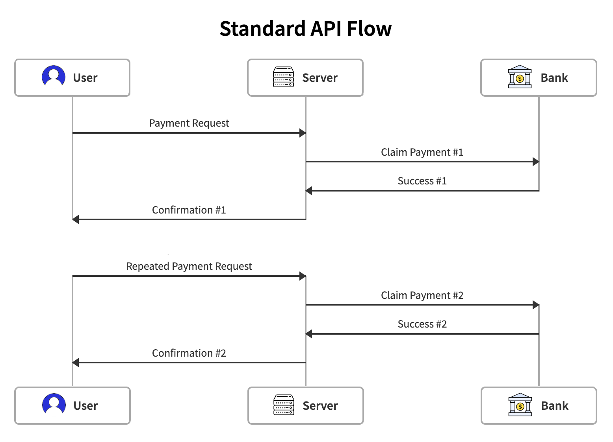
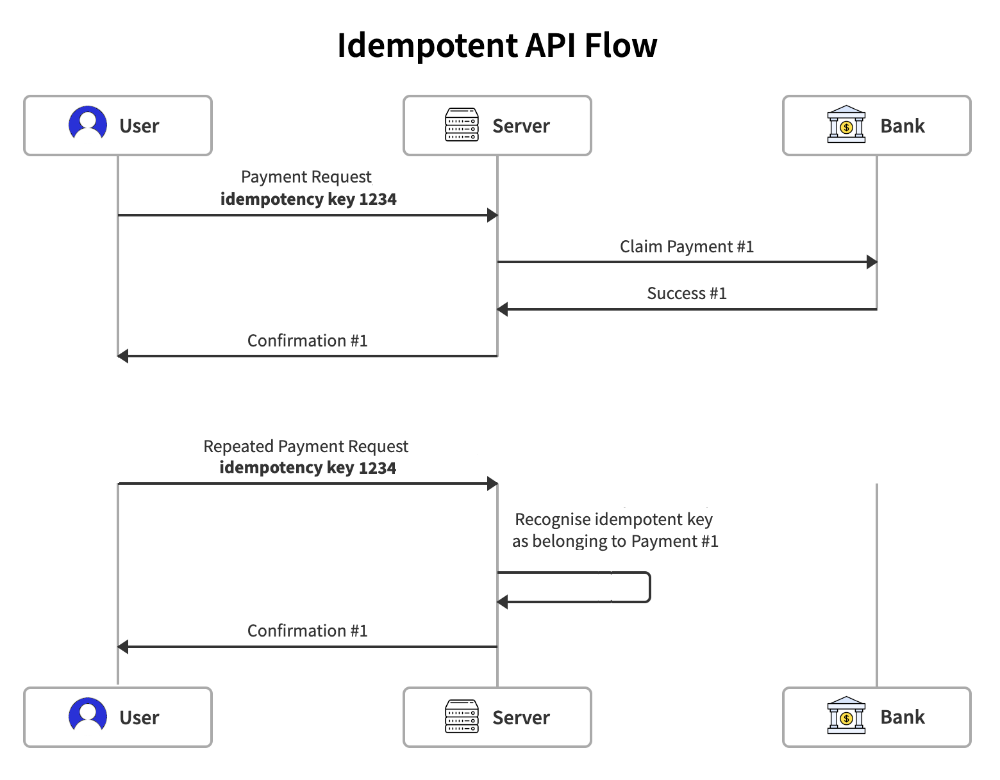
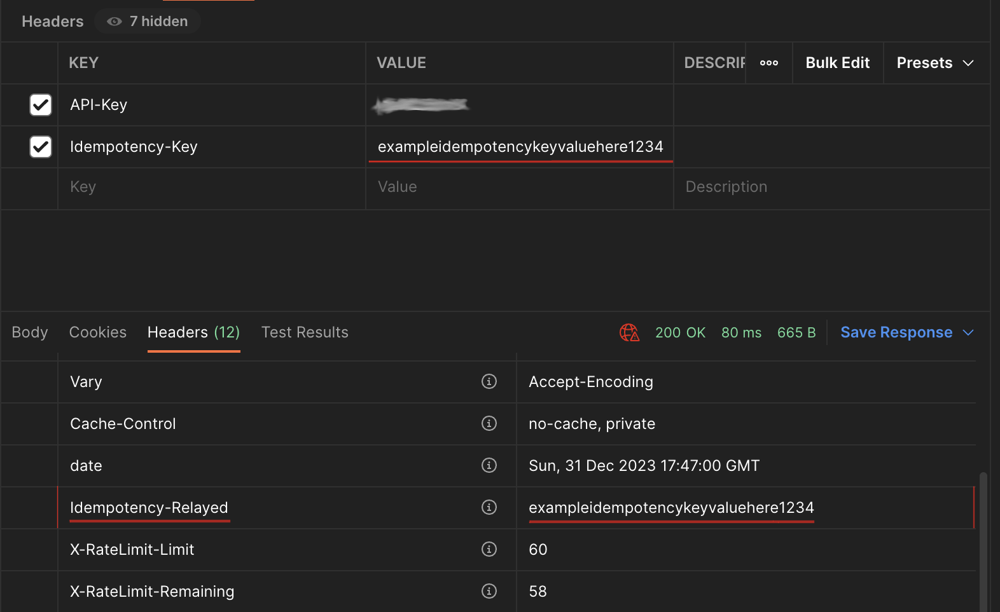

# Add Idempotency to your Laravel APIs

This package makes it easy to add support for [idempotency](https://en.wikipedia.org/wiki/Idempotence) keys to a Laravel API. When a request is received with a previously-used idempotency key, the server will return the same response generated for the original request, and avoid any re-processing on the server side. This is especially useful in situations where a request may be repeated due to network issues or user reattempts, such as with payment processing or form submissions.

# Table of Contents

| Table of Contents |
|-------------------|
| [What is Idempotency?](#what-is-idempotency) |
| [Package Features](#package-features) |
| [Installation](#installation) |
| [Configuration](#configuration) |
| [Usage](#usage) |
| [Recognising Idempotent Responses](#recognising-idempotent-responses) |
| [Exception Handling](#exception-handling) |
| [Versioning](#versioning) |
| [Tests](#tests) |
| [License](#license) |

## What is Idempotency?
Idempotency is the name given to the ability to make multiple identical requests, and only have the changes applied once. By adding a unique key to each incoming request, the server can detect a repeated request. If it has not seen that request before, the server can safely process it. If the key has been seen previously, the server can return the previous response, without re-processing the request. This is particularly useful if there are API clients operating with unreliable network conditions, where requests get automatically re-tried once a connection is re-established.

Consider the example of a payment request being made to an API.



In this scenario, the client has poor connectivity, so does not always receive the "Confirmation #1" response. When connectivity is lost then restored, the client will re-send the request. The risk here is that the original request has been processed correctly, leading to a duplicate payment request processed by the retried transaction, leading ultimately to "Confirmation #2".

In the above flow, our user will have been charged twice. Now, let's see how the same payment flow works when that same API and client implement idempotency.



In this flow, the client is generating an idempotent key for each request. The first payment request is made, and once again, the client does not receive the "Confirmation #1" response. However, when re-trying, the client is sending the **same idempotency key**. When this happens, the server recognises that it has already handled this request. The request is not re-processed on the backend (no communication at all with the bank to process the transaction!), and the original response is returned again ("Confirmation #1").


## Package Features

* **Idempotency Key Validation**: Ensures that each API request is unique and processed only once, preventing duplicate operations.
* **User-Specific Caching**: Idempotency keys are unique per user, based on Laravel's default authentication.
* **Customizable Cache Duration**: Set the default cache duration and customize it as needed.
* **Configurable Idempotency Header**: Customize the name of the idempotency header.
* **Flexible User ID Retrieval**: Change the method of retrieving the user ID based on your application's needs.


## Installation

This documentation covers the installation of the Idempotency package on the server side. The format of the idempotency keys generated by the client is not mandated by the package. Current [best practice](https://stripe.com/docs/api/idempotent_requests#:~:text=A%20client%20generates%20an%20idempotency,up%20to%20255%20characters%20long.) would be to use V4 UUIDs, or similar length random keys with sufficient entropy to avoid collisions.


### Require the package

``` bash
$ composer require square1/laravel-idempotency
```

The package will be automatically registered.


### Publish Configuration (Optional)

``` bash
php artisan vendor:publish --provider="Square1\LaravelIdempotency\IdempotencyServiceProvider"
```

This will create a `config/idempotency.php` file in your `config` directory.


## Configuration

After publishing the configuration file, you can modify it as per your requirements. The main configuration options available are:

* `cache_duration`: Time for which responses should be cached, in seconds. This value controls the period after which a re-used idempotency key would be treated as a new request. Defaults to 1 day.
* `idempotency_header`: The name of the request header used by the client to pass the idempotency key. Defaults to `Idempotency-Key`.
* `ignore_empty_key`: By default, if no idempotency key is passed when we expect one, a `MissingIdempotencyKeyException` exception will be thrown. If you wish to support requests where the key is missing, this can be set to `true` to prevent that exception being thrown. This may be useful during a period of api client update to roll out the key, for example. Defaults to `false`.
* `enforced_verbs`: An array of HTTP verbs against which idempotency checks should be applied. Typically GET and HEAD requests don't change state, so don't require idempotency checks, but this array can be edited if there are different verbs you wish to check against. The default set is `\Illuminate\Http\Request::METHOD_POST`, `::METHOD_PUT`, `::METHOD_PATCH`, and `::METHOD_DELETE`.
* `on_duplicate_behaviour`: By default, the package will replay previously-seen responses when an idempotency key is re-used. Your application may wish to handle this duplication differently - throwing an error, for example. Setting this value to `exception` will cause a `DuplicateRequestException` to be thrown in this case. Defaults to `replay`.
* `max_lock_wait_time`: To avoid race conditions, a cache lock is created when a request comes in. If another request comes in before the cache is populated but after the lock has been taken, the second request will internally poll every second to see if the cache is populated yet, giving up after this number of seconds.
* `user_id_resolver`: Idempotent keys are unique per-user, meaning that if two different users somehow use the same key, there won't be a key collision. This requires the package to build a cache key using the current authenticated user when building the cache. By default, the package will use Laravel's `auth()->user()->id` value. If you want to use a different value to uniquely identify your users, a class-method pair can be added to this value to implement that custom value.

``` php
    // Define custom resolver of per-user identifier.
    'user_id_resolver' => [ExampleUserIdResolver::class, 'resolveUserId'],
```

```php
// App\Services\ExampleUserIdResolver

namespace App\Services;

class ExampleUserIdResolver
{
    public function resolveUserId()
    {
        // Implement custom logic to return the user ID
        return session()->special_user_token;
    }
}
```


## Usage

The package's core functionality is provided through middleware. To use it, you simply need to add the middleware to your routes or controller.

**N.B** As this package needs to be aware of the current user, ensure that the middleware is added after any user authentication actions are performed.

### Global Usage

To apply the middleware to all routes, you can append it to the global middleware stack in your application's `bootstrap/app.php` file:

``` php
use Square1\LaravelIdempotency\Http\Middleware\IdempotencyMiddleware;

...
->withMiddleware(function (Middleware $middleware) {
     $middleware->append(IdempotencyMiddleware::class);
})
```

The `append` function here will add this middleware to the end of the global middlewares in your application. For more on handling middleware ordering in Laravel 12, please see [the docs](https://laravel.com/docs/12.x/middleware#global-middleware).


This will run the middleware on all of the routes in the application. However, the `enforced_verbs` value in the package configuration will control whether the middleware has any impact on a given route (by default the middleware won't interfere with GET or HEAD requests).

### Specific Routes
Alternatively, it can be targeted to specific routes.

You may append the middleware to all api routes, taking advantage of Laravel's [default middleware groups](https://laravel.com/docs/11.x/middleware#laravels-default-middleware-groups):

``` php
// bootstrap/app.php
use Square1\LaravelIdempotency\Http\Middleware\IdempotencyMiddleware;
...
->withMiddleware(function (Middleware $middleware) {
    $middleware->api(append: [
        IdempotencyMiddleware::class
    ]);
})
```

Or you can apply the middleware to specific routes inside your routes file:

``` php

Route::get('/profile', function () {
    // ...
})->middleware(IdempotencyMiddleware::class);
```


## Recognising Idempotent Responses
When a request is successfully performed, it will be returned to the client, and the response cached. After a repeat idempotency key is seen, this cache value is returned. In this case, an additional header, `Idempotency-Relayed` is returned. This header contains the same idempotency key sent by the client, and is a signal to clients that this response has been repeated. This header is only present on the repeated response, never the original one.




## Exception Handling

This package potentially throws a number of exceptions, all under the `Square1\LaravelIdempotency\Exceptions` namespace:

* `MismatchedPathException`: Thrown if a repeated request with the same idempotency key has a different request path. This is typically the sign of a bug in the client, where the key is not changed on each request, e.g. a client re-using the same key to request `POST /users` then `POST /accounts`.
* `DuplicateRequestException`: By default the package will replay a response when a previous idempotency key is seen again. Changing the config value `on_duplicate_behaviour` to `exception` will cause an exception to be thrown instead (useful for applications when a re-sent request is more likely a bug in the client).
* `LockExceededException`: To avoid race conditions for two requests with identical keys, each request that doesn't see a cached response already present first tries to acquire a cache lock. Only one request can get this lock, so the losing request(s) will poll the cache periodically to get the response. If the waiting time exceeds the value in `config('idempotency.max_lock_wait_time')`, a `LockExceededException` exception is thrown.
* `MissingIdempotencyKeyException`: Thrown when a request handled by the idempotency middleware does not have a key present. This check is performed after the `enforced_verbs` check, so, for example, if GET requests are not to be considered by the middleware, a GET request without a key won't trigger this exception. This exception will be thrown, unless the config value `ignore_empty_key` has been changed to `true`.


## Versioning
With the release of Laravel 12 support, the package versioning scheme changed to match that of Laravel's major releases.

| Package Version | Laravel Version(s) |
|-----------------|--------------------|
| 12.*            | 12, 11             |
| 2.0.0           | 11, 10, 9          |
| 1.*             | 10,9               |


## Tests
```bash
$ composer test
```

## License

The MIT License (MIT). Please see [License File](LICENSE.md) for more information.
